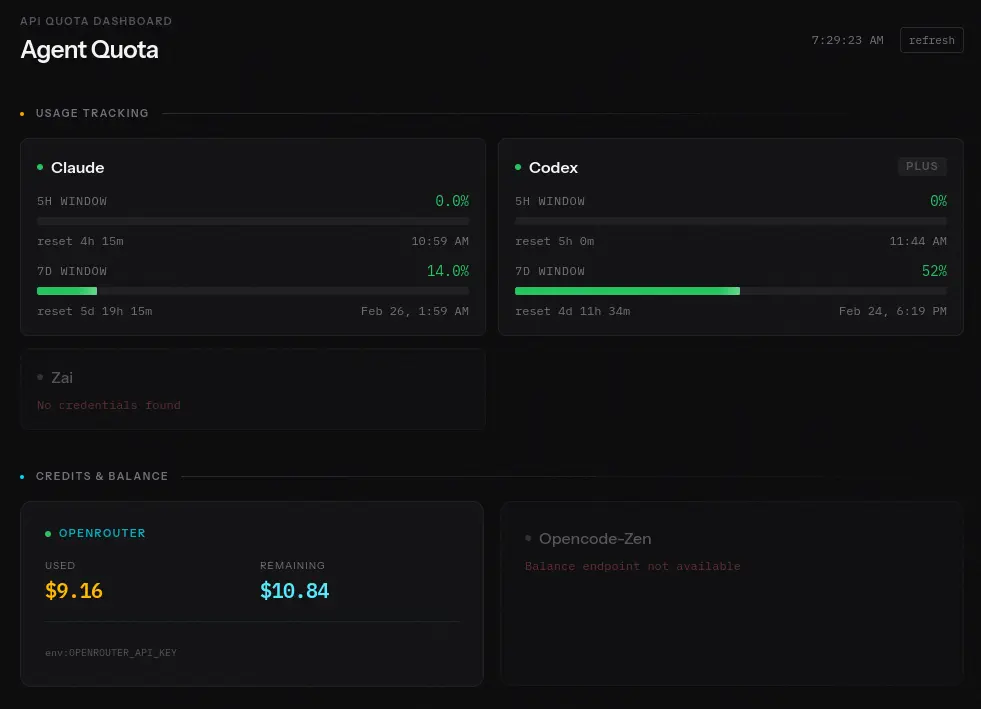

# Agent Quota

AI Coding Assistant Usage Dashboard - monitor your Claude, Codex, and Z.AI subscription quotas in one place.also openrouter and eventually opencode zen

runs locally.
[noctalia plugin](https://github.com/peculiarnewbie/agent-quota/tree/main/noctalia)
[vite app](https://github.com/peculiarnewbie/agent-quota/tree/main/vite%2Bbun)

inspired by [openusage](https://www.openusage.ai/) and [cclimits](https://github.com/cruzanstx/cclimits)
